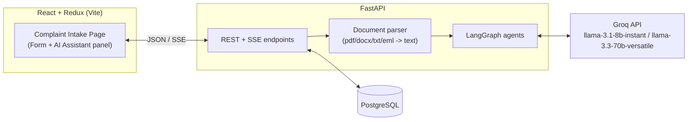
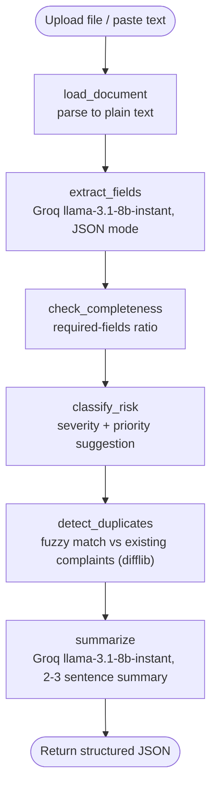
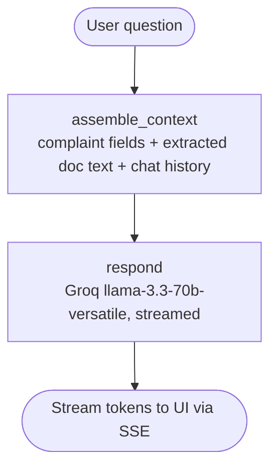

# AIVOA Complaint Management System — Implementation Plan

Source: `july new posting - internshala new post.docx` + embedded reference UI screenshot.
Two screens are implied by the screenshot: a **complaint form** (left) auto-filled by an
**AI Intake Assistant** (right) that accepts a dropped/pasted document and chats about it.

Scope note: this is a graded take-home, not a production system. The plan below is sized
for that — one dev, ~a few days of work, judged on working functionality + explainability,
not on infra sophistication. Things a real pharma QMS would need (auth/RBAC, audit trail,
21 CFR Part 11 e-signatures, real OCR) are explicitly out of scope — called out at the end.

---

## 1. Confirmed Stack

| Layer | Choice | Why |
|---|---|---|
| Frontend | React + Redux Toolkit (RTK Query for API calls) | RTK Query ships inside Redux Toolkit — no extra HTTP lib needed |
| Backend | FastAPI (Python) | mandated |
| AI orchestration | LangGraph | mandated |
| LLM | Groq `llama-3.1-8b-instant` (extraction/classification), `llama-3.3-70b-versatile` (chat + reasoning-heavy bonus features) | mandated; split by task cost/latency. The assessment doc named `gemma2-9b-it` — Groq decommissioned it after the doc was written, so it's swapped for `llama-3.1-8b-instant`, the closest still-supported equivalent (small/fast/cheap, same role) |
| DB | PostgreSQL | JSONB column is a natural fit for storing raw AI extraction output alongside typed columns |
| Font | Google Inter | mandated |
| Local infra | `docker-compose` for Postgres only | avoids "install Postgres by hand"; backend/frontend still run natively for fast iteration |

No auth library, no ORM migration tool (Alembic), no vector DB, no message queue — none of
these are needed at this scope (see §9).

---

## 2. High-Level Architecture



---

## 3. Data Model (PostgreSQL)

```sql
complaints
  id                  serial PK
  status              text        -- pending_triage | triaged | closed
  complaint_source    text
  customer_name       text
  product_name        text
  product_strength    text
  batch_lot_number    text
  manufacturing_date  date
  expiry_date         date
  quantity_affected   numeric
  quantity_unit       text
  complaint_type      text
  complaint_date      date
  description         text
  initial_severity    text        -- critical | major | minor
  priority            text        -- high | medium | low
  completeness_score  numeric     -- bonus: completeness checker
  risk_classification text        -- bonus: AI risk classification
  ai_summary          text        -- bonus: complaint summary
  raw_extraction      jsonb       -- full LLM output incl. per-field confidence
  created_at, updated_at timestamptz

complaint_documents
  id             serial PK
  complaint_id   FK -> complaints.id
  filename, file_type
  extracted_text text
  uploaded_at    timestamptz
```

No `chat_messages` table (see §4.2 — chat is stateless, not DB-backed).

SQLAlchemy models + `Base.metadata.create_all()` on startup. No Alembic — single schema,
no prior deployment to migrate from.

---

## 4. LangGraph Agents

### 4.1 Extraction graph (runs on upload/paste)



- **load_document**: stdlib/`pypdf` for PDF, `python-docx` for DOCX, stdlib `email` for
  `.eml`, plain read for `.txt`. No OCR — doc explicitly says production-grade OCR isn't
  required, so image-only PDFs are out of scope. The assessment doc mentions "PDFs,
  emails, or images" as demo material, but the reference UI's own upload panel only
  advertises `PDF, DOCX, TXT, EML` — so images are for creating demo content (e.g. a
  screenshot pasted into a doc), not a required upload type. Match the UI, not the prose.
- **extract_fields**: single Groq call, `response_format={"type": "json_object"}`, prompt
  gives the exact field list from the form + expected types. This is the only node that
  must succeed for the form to populate; the rest are enrichment and can fail soft.
- **check_completeness**: pure Python — fraction of a fixed required-field list that's
  non-null: `customer_name, product_name, batch_lot_number, complaint_type, description`
  (the fields you'd actually need to start triage). No LLM call needed (rung 6: it's a
  one-liner).
- **classify_risk**: reuses `llama-3.1-8b-instant` with product/severity context to suggest
  initial severity + priority (bonus: *AI Risk Classification*). Prompt constrains output
  to the same enums the frontend `<select>` uses (`critical|major|minor`,
  `high|medium|low`). If the model returns anything outside that set, treat it like a
  failed node — leave the dropdown unset rather than writing an invalid value into a
  constrained field.
- **detect_duplicates**: `difflib.SequenceMatcher` over `(product_name, batch_lot_number,
  description)` against recent complaints in Postgres. No embeddings/vector DB — a fuzzy
  string match on a handful of fields is enough to demo the concept at this data scale.
- **summarize**: bonus *Complaint Summary* feature, one more Groq call.

Progress is reported to the frontend as each node completes (matches the "Extraction
Progress" bar in the reference UI) via **SSE** from `POST /api/complaints/extract`.

Deliberately **not** built as separate bonus features: *Root Cause Recommendation* and
*CAPA Recommendation*. They need real complaint history / CAPA data to be credible — with
synthetic demo data they'd just be generic LLM guesses. Flagged as stretch goals if time
remains, using `llama-3.3-70b-versatile` (needs more reasoning depth than llama-3.1-8b-instant).

### 4.2 Chat graph (AI Assistant panel, right side)



Single-node graph — a full multi-tool agent isn't warranted for "ask questions about this
one complaint." LangGraph is still used (mandated + keeps both agents in one consistent
mental model), just with one LLM node instead of a tool-calling loop.

**Stateless, not DB-backed.** The reference UI shows the assistant active during intake,
before the complaint is saved — so it can't be keyed off a saved complaint's DB id. The
frontend holds the current form fields, source text, and conversation history in Redux
and resends them with every turn; the backend has no `/complaints/{id}/chat` route and no
`chat_messages` table. Simpler than persisting history for a feature nothing yet reads
back (no complaint-detail page exists to show past conversations).

---

## 5. Backend Layout

```
backend/
  app/
    main.py                 # FastAPI app, CORS, router mounts
    core/config.py          # env vars: GROQ_API_KEY, DATABASE_URL
    db/
      models.py             # SQLAlchemy models (§3)
      session.py
    services/
      document_parser.py    # §4.1 load_document
    agents/
      groq_client.py        # thin wrapper: model name -> Groq chat call
      extraction_graph.py    # §4.1 LangGraph
      chat_graph.py           # §4.2 LangGraph
      prompts.py             # extraction/classification/summary/chat prompts
    schemas/complaint.py    # Pydantic request/response models
    api/
      complaints.py         # extract, CRUD, list
      chat.py                # stateless chat endpoint (§4.2)
  requirements.txt
  .env.example
```

### Endpoints

| Method | Path | Purpose |
|---|---|---|
| POST | `/api/complaints/extract` | upload file or paste text → SSE stream of graph progress + final extracted fields |
| POST | `/api/complaints` | save (create) reviewed complaint |
| GET | `/api/complaints` / `/api/complaints/{id}` | list / detail |
| POST | `/api/complaints/chat` | ask the AI assistant about the complaint currently in the form (fields + history sent by client), SSE streamed reply |

- **Upload validation (trust boundary)**: reject before parsing if the file isn't
  `pdf/docx/txt/eml` or exceeds 10MB — matches the limits the reference UI already states
  ("Supported formats... Max file size: 10MB"). Return 4xx with a clear message; don't let
  bad input reach the parser or spend an LLM call on it.
- **Streaming mechanics**: `/extract` and `/chat` are POST endpoints returning
  `text/event-stream`. The browser's `EventSource` API only supports GET with no body, so
  it can't carry an uploaded file or a chat message — consume both with `fetch()` + a
  `ReadableStream` reader on the frontend instead, not `EventSource`.
- **Groq call resilience**: wrap calls in `groq_client.py` with a timeout and one retry on
  HTTP 429 (rate limit) — free-tier limits are easy to hit live during a demo/interview,
  and an unhandled 429 would otherwise kill the whole extraction graph.

---

## 6. Frontend Layout

```
frontend/
  src/
    app/store.ts                       # Redux store
    api/complaintsApi.ts               # RTK Query endpoints
    features/
      complaintForm/
        complaintFormSlice.ts          # form field state, populated from extraction
        ComplaintForm.tsx              # left panel, 4 sections per screenshot
      aiIntake/
        AIIntakePanel.tsx              # right panel: dropzone + paste + progress + chat
        Dropzone.tsx
        ChatBox.tsx
    components/                        # Input, Select, Badge, Button (shared, Inter font)
    pages/ComplaintIntakePage.tsx      # two-column layout matching screenshot
    App.tsx
```

- **RTK Query** for `extract`/save/chat calls — no axios needed, it's already inside RTK.
- Extraction progress bar is driven by SSE events dispatched into
  `complaintFormSlice`/an `extractionSlice` (status per node from §4.1).
- Google Inter loaded via `@fontsource/inter` or a `<link>` to Google Fonts in `index.html`.

---

## 7. Build Order (milestones)

1. **Scaffold**: FastAPI hello-world + React/Redux hello-world + Postgres via
   docker-compose + Groq key wired end-to-end with one trivial call. Confirms the whole
   chain works before any real logic.
2. **CRUD first**: DB models, complaint save/list/detail endpoints, static form UI wired
   to Redux — manual entry works with zero AI involved.
3. **Document intake**: upload/paste endpoint + `load_document` parsers, returns raw text
   (no LLM yet) — confirms file handling before spending Groq calls on it.
4. **Extraction graph**: `extract_fields` node live, auto-fills the form via SSE +
   progress bar.
5. **Enrichment nodes**: completeness checker, risk classification, summary — pick these
   three bonus features first since they're LLM-light and demo well.
6. **Duplicate detection**: fuzzy match against stored complaints.
7. **Chat assistant**: context-aware Q&A panel, streamed.
8. **UI polish**: match reference screenshot spacing/badges/Inter font, empty/error states.
9. **README + demo video**: cover AI tools, frontend workflow, code/architecture flow,
   LangGraph design, key decisions (matches the deliverables list in the assessment doc).

---

## 8. Prompt/Model Notes

- Extraction prompt gives the LLM the exact target JSON schema (field names matching the
  DB columns in §3) and instructs it to leave a field `null` rather than guess when the
  source document doesn't mention it — avoids confidently-wrong autofill.
- `llama-3.1-8b-instant` for extraction/classification/summary: fast, cheap, structured, single-
  document context — no need for a bigger model.
- `llama-3.3-70b-versatile` reserved for chat and any stretch reasoning feature (root
  cause / CAPA) where broader inference over the complaint helps.
- All Groq calls go through one `groq_client.py` wrapper (model name + messages in,
  parsed response out) so swapping models later is a one-line change, not a refactor.

---

## 9. Explicitly Out of Scope (and why)

- **Auth/RBAC** — assessment doc doesn't ask for it; a single-user demo doesn't need it.
- **Alembic migrations** — one schema, no deployed history to migrate.
- **Vector DB / embeddings** — `difflib` fuzzy match is enough to demonstrate duplicate
  detection at demo data volumes; add pgvector only if the complaint volume in the demo
  actually needs semantic (not lexical) matching.
- **Production OCR** — doc says it isn't required; scanned-image PDFs are out of scope.
- **Root Cause / CAPA recommendation** — deferred to stretch time; without real historical
  CAPA data these would be unconvincing generic LLM output.
- **Docker for backend/frontend** — only Postgres is containerized; running the app
  natively is faster to iterate on during a graded assessment.

---

## 10. Minimal Tests

No custom test harness or fixtures — just one runnable check per piece of logic that could
silently break and produce a wrong-looking-right answer:

- `test_document_parser.py` — each parser (pdf/docx/txt/eml) returns non-empty text for a
  known sample file.
- `test_completeness.py` — `check_completeness` scores a fully-populated dict as 1.0 and a
  half-empty one as 0.5, against the fixed required-field list in §4.1.
- `test_duplicates.py` — `detect_duplicates` flags two near-identical descriptions and
  does not flag two unrelated ones.
- `test_date_coercion.py` — `ExtractedFields` accepts ISO dates, rejects non-ISO strings,
  and tolerates missing dates.
- `test_field_normalization.py` — `_normalize_null` maps the model's stringified-null
  variants (`"null"`, `"n/a"`, `"unknown"`, ...) to `None` and leaves real values alone.

Skip testing the LLM call itself — no assertion on model output is more efficient than
`assert response is not None` theatre; the useful checks are the deterministic code around it.

## 11. Deliverables Checklist

Straight from the assessment doc's submission requirements — track against this before
submitting:

- [x] GitHub repository (pushed — `mdsvr/AIVOA-Assessment`)
- [x] README: setup instructions + project overview (`README.md` — Setup section + overview)
- [ ] 10–15 min demo video covering:
  - [ ] working of all implemented AI tools (extraction, completeness, risk classification,
        duplicate detection, summary, chat)
  - [ ] frontend workflow (matches reference UI)
  - [ ] code flow and architecture (§2, §5, §6)
  - [ ] LangGraph implementation (§4 — walk both graphs node by node)
  - [ ] key design decisions (§9 out-of-scope list doubles as "why not X" talking points)
- [ ] Submitted via the Google Form in the assessment doc

## 12. Before Writing Code

Watch the demo video (`https://drive.google.com/file/d/1av2lzDPx8YMSzTrIz7w51HTRWBz3_5Nj`)
— this plan is built from the assessment doc text and the reference UI screenshot only,
since the video couldn't be fetched here. Confirm the exact intake→triage→save workflow
matches §4.1/§7 before implementing, and adjust node order/fields if the video shows
something the screenshot doesn't (e.g. a distinct "triage" step after save).
